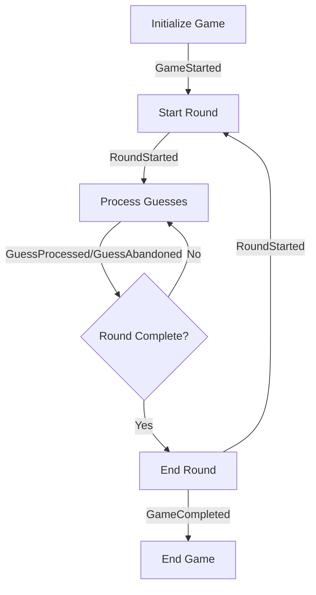

# BaseMode Event Handling Guide

## Overview
This document details the event handling requirements and implementation guidelines for the `GameBot.Domain.GameModes.BaseMode` module, focusing on proper event sourcing integration.

## Core Principles

1. **Event-Driven State Management**
   - All state changes must be event-driven
   - Events are immutable and versioned
   - State can be reconstructed from event stream

2. **Validation First**
   - All events must be validated before processing
   - State transitions must be explicitly validated
   - Team and player validation must be standardized

3. **Atomic Operations**
   - State updates must be atomic with event emission
   - Events must be emitted in correct order
   - State must be consistent after each operation

4. **Error Handling**
   - Clear error types and messages
   - Proper error propagation
   - Graceful failure handling

## Event Flow

### 1. Game Lifecycle Events



### 2. Event Sequence Requirements

#### Game Start Sequence
```elixir
def initialize_game(mode, game_id, teams, config) do
  with :ok <- validate_game_params(mode, teams, config),
       state <- GameState.new(mode, teams),
       :ok <- validate_state!(state),
       event <- build_game_started_event(state, game_id, teams, config),
       :ok <- validate_event!(event) do
    {:ok, state, [event]}
  else
    {:error, reason} -> {:error, reason}
  end
end

defp build_game_started_event(state, game_id, teams, config) do
  build_base_event(state, GameStarted, %{
    game_id: game_id,
    mode: state.mode,
    round_number: 1,
    teams: teams,
    team_ids: Map.keys(teams),
    player_ids: List.flatten(Map.values(teams)),
    config: config,
    timestamp: DateTime.utc_now(),
    metadata: build_metadata(state)
  })
end
```

#### Round Management
```elixir
def start_round(state) do
  with :ok <- validate_transition!(state, :start_round),
       event <- build_round_started_event(state),
       :ok <- validate_event!(event) do
    state = update_in(state.round_number, &(&1 + 1))
    state = put_in(state.status, :in_round)
    {:ok, state, [event]}
  end
end

def end_round(state, winners) do
  with :ok <- validate_transition!(state, :end_round),
       event <- build_round_completed_event(state, winners),
       :ok <- validate_event!(event) do
    state = put_in(state.status, :round_ended)
    {:ok, state, [event]}
  end
end
```

#### Guess Processing
```elixir
def process_guess_pair(state, team_id, guess_pair) do
  with :ok <- validate_guess_pair(state, team_id, guess_pair),
       event <- build_guess_processed_event(state, team_id, guess_pair),
       :ok <- validate_event!(event) do
    state = update_state_after_guess(state, team_id, event)
    {:ok, state, [event]}
  end
end

def handle_guess_abandoned(state, team_id, reason, last_guess) do
  with :ok <- validate_transition!(state, :abandon_guess),
       event <- build_guess_abandoned_event(state, team_id, reason, last_guess),
       :ok <- validate_event!(event) do
    state = update_abandon_statistics(state, team_id, event)
    {:ok, state, [event]}
  end
end
```

## Event Validation

### 1. Common Validation Rules
```elixir
def validate_event!(event) do
  with :ok <- validate_base_fields(event),
       :ok <- validate_metadata(event.metadata),
       :ok <- validate_mode_specific(event) do
    :ok
  else
    {:error, reason} -> raise ArgumentError, message: reason
  end
end

defp validate_base_fields(event) do
  required = [:game_id, :mode, :round_number, :timestamp]
  case Enum.find(required, &(is_nil(Map.get(event, &1)))) do
    nil -> :ok
    field -> {:error, "Missing required field: #{field}"}
  end
end

defp validate_metadata(metadata) do
  required = [:client_version, :server_version, :correlation_id, :timestamp]
  case Enum.find(required, &(is_nil(metadata[&1]))) do
    nil -> :ok
    field -> {:error, "Missing required metadata field: #{field}"}
  end
end
```

### 2. State Validation
```elixir
def validate_state!(state) do
  cond do
    is_nil(state.mode) ->
      raise ArgumentError, "game mode is required"
    is_nil(state.round_number) ->
      raise ArgumentError, "round number is required"
    map_size(state.teams) == 0 ->
      raise ArgumentError, "at least one team is required"
    true -> :ok
  end
end

def validate_transition!(state, action) do
  case {state.status, action} do
    {:waiting, :start_round} -> :ok
    {:in_round, :process_guess} -> :ok
    {:in_round, :abandon_guess} -> :ok
    {:in_round, :end_round} -> :ok
    {status, action} ->
      {:error, "Invalid transition: #{action} not allowed in #{status} state"}
  end
end
```

## Event Building

### 1. Base Event Structure
```elixir
def build_base_event(state, type, fields) do
  Map.merge(
    %{
      game_id: state.game_id,
      mode: state.mode,
      round_number: state.round_number,
      timestamp: DateTime.utc_now(),
      metadata: build_metadata(state)
    },
    fields
  )
  |> struct(type)
end

def build_metadata(state, opts \\ []) do
  %{
    client_version: Application.spec(:game_bot, :vsn),
    server_version: System.version(),
    correlation_id: state.correlation_id || generate_correlation_id(),
    causation_id: opts[:causation_id],
    timestamp: DateTime.utc_now()
  }
end
```

### 2. Event Versioning
```elixir
def version_event(event) do
  Map.put(event, :version, event.__struct__.event_version())
end

def validate_version(event) do
  case event.version do
    v when v > 0 -> :ok
    _ -> {:error, "invalid event version"}
  end
end
```

## State Management

### 1. State Updates
```elixir
def update_state_after_guess(state, team_id, event) do
  state
  |> increment_guess_count(team_id)
  |> update_last_activity()
  |> maybe_record_match(team_id, event)
end

def update_abandon_statistics(state, team_id, event) do
  state
  |> increment_abandon_count(team_id)
  |> update_last_activity()
  |> record_abandon(team_id, event)
end
```

### 2. State Recovery
```elixir
def rebuild_from_events(events) do
  Enum.reduce(events, initial_state(), fn event, state ->
    apply_event(state, event)
  end)
end

defp apply_event(state, %GameStarted{} = event) do
  %{state |
    game_id: event.game_id,
    mode: event.mode,
    teams: event.teams,
    round_number: 1,
    start_time: event.timestamp
  }
end

defp apply_event(state, %GuessProcessed{} = event) do
  state
  |> update_state_after_guess(event.team_id, event)
  |> maybe_complete_round(event)
end
```

## Implementation Guidelines

### 1. Event Generation
- Always validate before emission
- Include all required metadata
- Maintain event ordering
- Version all events

### 2. State Updates
- Atomic state transitions
- Validate before update
- Handle edge cases
- Maintain consistency

### 3. Error Handling
- Clear error messages
- Proper error types
- Graceful degradation
- Comprehensive logging

### 4. Recovery
- Full state reconstruction
- Event sequence validation
- Proper error handling
- Performance optimization

## Testing Requirements

### 1. Event Tests
- Validate event structure
- Test metadata generation
- Verify event ordering
- Check versioning

### 2. State Tests
- Verify state transitions
- Test recovery from events
- Check edge cases
- Validate consistency

### 3. Integration Tests
- Full game sequences
- Error scenarios
- Recovery paths
- Performance benchmarks

## Implementation Status

### Completed
1. ✅ Base event structure
2. ✅ Common validation
3. ✅ State management
4. ✅ Error handling

### In Progress
1. 🔶 Event versioning
2. 🔶 State recovery
3. 🔶 Performance optimization

### Planned
1. ❌ Event schema evolution
2. ❌ Event store integration
3. ❌ Metrics and monitoring 