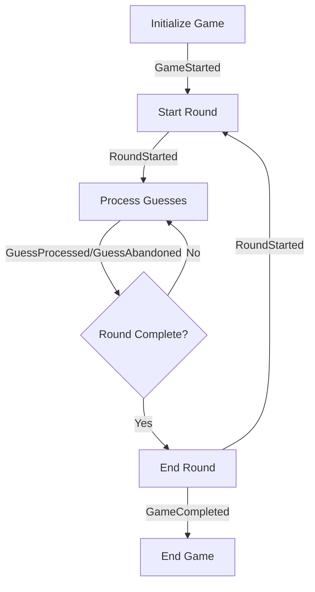

# BaseMode Event Handling Guide

## Overview
This document details the event handling requirements and implementation guidelines for the `GameBot.Domain.GameModes.BaseMode` module, focusing on proper event sourcing integration.

## Event Flow

### 1. Game Lifecycle Events



### 2. Event Sequence Requirements

#### Game Start Sequence
```elixir
def initialize_game(mode, game_id, teams, roles, config) do
  with :ok <- validate_game_params(mode, teams, roles, config),
       state <- GameState.new(mode, teams),
       :ok <- validate_state!(state),
       event <- build_game_started_event(state, game_id, teams, roles, config),
       :ok <- validate_event!(event) do
    {:ok, state, [event]}
  else
    {:error, reason} -> {:error, reason}
  end
end

defp build_game_started_event(state, game_id, teams, roles, config) do
  %GameStarted{
    game_id: game_id,
    mode: state.mode,
    round_number: 1,
    teams: teams,
    team_ids: Map.keys(teams),
    player_ids: List.flatten(Map.values(teams)),
    roles: roles,
    config: config,
    timestamp: DateTime.utc_now(),
    metadata: build_metadata(state)
  }
end
```

#### Round Management
```elixir
def start_round(state) do
  with :ok <- validate_transition!(state, :start_round),
       event <- build_round_started_event(state),
       :ok <- validate_event!(event) do
    state = update_in(state.round_number, &(&1 + 1))
    state = put_in(state.status, :in_round)
    {:ok, state, event}
  end
end

def end_round(state, winners) do
  with :ok <- validate_transition!(state, :end_round),
       event <- build_round_completed_event(state, winners),
       :ok <- validate_event!(event) do
    state = put_in(state.status, :round_ended)
    {:ok, state, event}
  end
end
```

#### Guess Processing
```elixir
def process_guess_pair(state, team_id, guess_pair) do
  with :ok <- validate_transition!(state, :process_guess),
       :ok <- validate_guess_pair(state, team_id, guess_pair),
       {state, event} <- build_guess_processed_event(state, team_id, guess_pair),
       :ok <- validate_event!(event) do
    state = update_guess_statistics(state, team_id, event)
    {:ok, state, event}
  end
end

def handle_guess_abandoned(state, team_id, reason, last_guess) do
  with :ok <- validate_transition!(state, :abandon_guess),
       event <- build_guess_abandoned_event(state, team_id, reason, last_guess),
       :ok <- validate_event!(event) do
    state = update_abandon_statistics(state, team_id, event)
    {:ok, state, event}
  end
end
```

## Event Validation

### 1. Common Validation Rules

```elixir
defmodule GameBot.Domain.EventValidation do
  def validate_common_fields(event) do
    cond do
      is_nil(event.game_id) ->
        {:error, "game_id is required"}
      is_nil(event.mode) ->
        {:error, "mode is required"}
      is_nil(event.round_number) ->
        {:error, "round_number is required"}
      is_nil(event.timestamp) ->
        {:error, "timestamp is required"}
      true ->
        :ok
    end
  end
  
  def validate_metadata(metadata) do
    required_fields = [:client_version, :server_version, :correlation_id]
    case Enum.find(required_fields, &(is_nil(metadata[&1]))) do
      nil -> :ok
      field -> {:error, "#{field} is required in metadata"}
    end
  end
end
```

### 2. Event-Specific Validation

```elixir
defmodule GameBot.Domain.EventValidators do
  def validate_game_started(%GameStarted{} = event) do
    with :ok <- validate_common_fields(event),
         :ok <- validate_teams(event.teams),
         :ok <- validate_roles(event.roles, event.player_ids) do
      :ok
    end
  end
  
  def validate_guess_processed(%GuessProcessed{} = event) do
    with :ok <- validate_common_fields(event),
         :ok <- validate_player_info(event.player1_info),
         :ok <- validate_player_info(event.player2_info),
         :ok <- validate_words(event.player1_word, event.player2_word) do
      :ok
    end
  end
  
  # Add validators for other events...
end
```

## Event Metadata

### 1. Metadata Structure

```elixir
@type metadata :: %{
  client_version: String.t(),
  server_version: String.t(),
  correlation_id: String.t(),
  causation_id: String.t() | nil,
  user_agent: String.t() | nil,
  ip_address: String.t() | nil
}
```

### 2. Metadata Generation

```elixir
def build_metadata(state, opts \\ []) do
  base_metadata = %{
    client_version: Application.spec(:game_bot, :vsn),
    server_version: System.version(),
    correlation_id: state.correlation_id || generate_correlation_id(),
    timestamp: DateTime.utc_now()
  }
  
  # Add optional fields if provided
  Enum.reduce(opts, base_metadata, fn
    {:causation_id, id}, acc -> Map.put(acc, :causation_id, id)
    {:user_agent, ua}, acc -> Map.put(acc, :user_agent, ua)
    {:ip_address, ip}, acc -> Map.put(acc, :ip_address, ip)
    _, acc -> acc
  end)
end
```

## Event Storage

### 1. Event Versioning

```elixir
defmodule GameBot.Domain.EventVersioning do
  def version_event(event) do
    Map.put(event, :version, event.__struct__.event_version())
  end
  
  def validate_version(event) do
    case event.version do
      v when v > 0 -> :ok
      _ -> {:error, "invalid event version"}
    end
  end
end
```

### 2. Event Serialization

```elixir
defmodule GameBot.Domain.EventSerialization do
  def serialize(event) do
    event
    |> version_event()
    |> to_map()
    |> Jason.encode!()
  end
  
  def deserialize(json, event_type) do
    with {:ok, data} <- Jason.decode(json),
         module <- get_event_module(event_type),
         event <- struct(module, data),
         :ok <- validate_version(event) do
      {:ok, event}
    end
  end
end
```

## Implementation Guidelines

### 1. Event Creation Rules

1. Always validate state before creating events
2. Include all required metadata
3. Version all events
4. Validate events before emission
5. Handle event creation errors gracefully

### 2. Event Handling Rules

1. Process events atomically
2. Update state based on event data
3. Maintain event ordering
4. Handle event failures gracefully
5. Log event processing errors

### 3. Testing Requirements

1. Test all event validations
2. Verify event metadata
3. Test event serialization/deserialization
4. Verify event ordering
5. Test error conditions

## Migration Notes

1. Add event versioning to all existing events
2. Implement metadata handling
3. Add validation for all events
4. Update event processing to handle versions
5. Add error handling for event processing

## Success Criteria

1. All events are properly validated
2. Event metadata is complete
3. Events are versioned
4. Event processing is atomic
5. Error handling is comprehensive
6. Events can be serialized/deserialized
7. Event ordering is maintained 