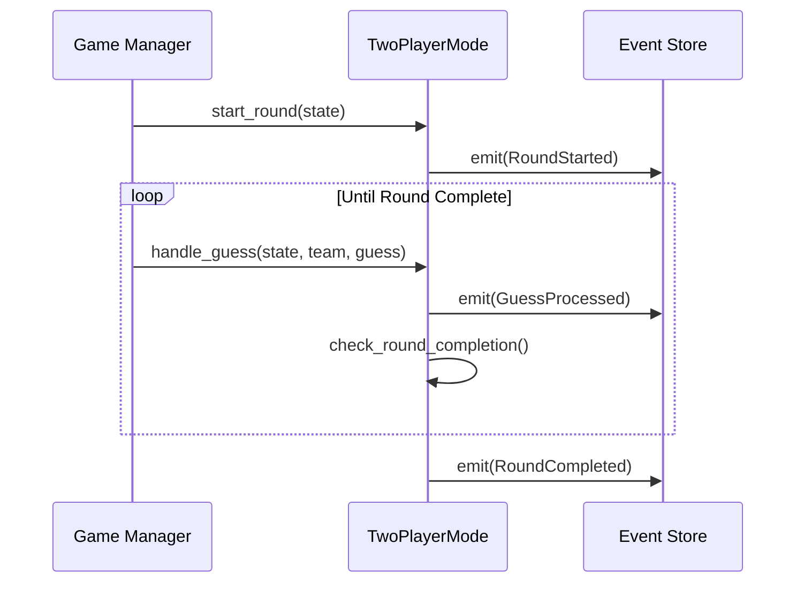
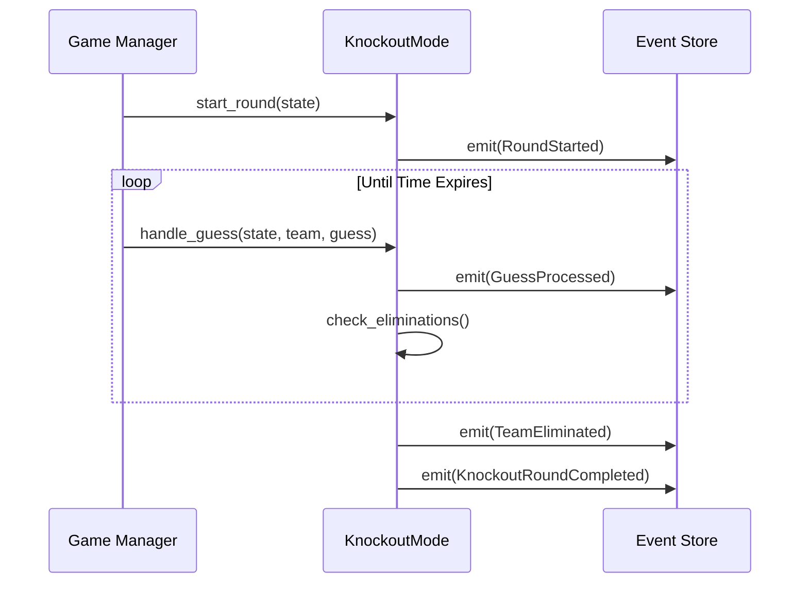

# Game Modes Architecture

## Overview

The game modes system is built on a modular architecture that separates common game functionality from mode-specific behavior. This design allows for maximum code reuse while maintaining flexibility for different game modes.

## Module Structure

```
game_bot/lib/game_bot/domain/game_modes/
├── base_mode.ex              # Core behavior and common functionality
├── behaviours/
│   ├── game_mode.ex         # Behaviour specification
│   ├── round_manager.ex     # Round management behaviour
│   └── scoring.ex           # Scoring behaviour
├── implementations/
│   ├── two_player_mode.ex   # Standard two-player implementation
│   ├── knockout_mode.ex     # Tournament-style elimination mode
│   ├── race_mode.ex         # Time-based racing mode
│   ├── golf_mode.ex         # Score optimization mode
│   └── longform_mode.ex     # Extended duration mode
└── shared/
    ├── state.ex             # Common state management
    ├── validation.ex        # Shared validation logic
    └── events.ex            # Common event building
```

## Core Behaviors

### GameMode Behavior
```elixir
defmodule GameBot.Domain.GameModes.Behaviour.GameMode do
  @moduledoc """
  Defines the core behavior that all game modes must implement.
  """

  @type game_id :: String.t()
  @type team_id :: String.t()
  @type player_id :: String.t()
  @type error :: {:error, term()}

  @callback init(game_id(), teams(), roles(), config()) ::
    {:ok, GameState.t()} | error()

  @callback handle_guess(GameState.t(), team_id(), guess()) ::
    {:ok, GameState.t(), [Event.t()]} | error()

  @callback handle_timeout(GameState.t(), team_id()) ::
    {:ok, GameState.t(), [Event.t()]} | error()

  @callback check_completion(GameState.t()) ::
    {:complete, winners(), GameState.t()} | {:continue, GameState.t()} | error()
end
```

### RoundManager Behavior
```elixir
defmodule GameBot.Domain.GameModes.Behaviour.RoundManager do
  @moduledoc """
  Defines round management behavior. Different for each mode.
  """

  @callback start_round(GameState.t()) ::
    {:ok, GameState.t(), [Event.t()]} | error()

  @callback end_round(GameState.t()) ::
    {:ok, GameState.t(), [Event.t()]} | error()

  @callback check_round_completion(GameState.t()) ::
    {:complete, GameState.t()} | {:continue, GameState.t()} | error()
end
```

### Scoring Behavior
```elixir
defmodule GameBot.Domain.GameModes.Behaviour.Scoring do
  @moduledoc """
  Defines scoring behavior. Implementation varies by mode.
  """

  @callback calculate_score(GameState.t(), team_id(), guess_result()) ::
    {:ok, score(), GameState.t()} | error()

  @callback update_rankings(GameState.t(), team_id(), score()) ::
    {:ok, GameState.t()} | error()
end
```

## Base Mode Implementation

```elixir
defmodule GameBot.Domain.GameModes.BaseMode do
  @moduledoc """
  Provides core functionality and common implementations for all game modes.
  """

  # Common Event Building
  def build_game_started_event(state, game_id, teams, roles, config) do
    %GameStarted{
      game_id: game_id,
      mode: state.mode,
      teams: teams,
      roles: roles,
      config: config,
      timestamp: DateTime.utc_now(),
      metadata: build_metadata(state)
    }
  end

  # Common Validation
  def validate_guess_pair(state, team_id, guess_pair) do
    with :ok <- validate_team(state, team_id),
         :ok <- validate_players(state, team_id, guess_pair),
         :ok <- validate_words(guess_pair) do
      :ok
    end
  end

  # Common State Management
  def update_state_after_guess(state, team_id, guess_result) do
    state
    |> increment_guess_count(team_id)
    |> update_last_activity()
    |> maybe_record_match(team_id, guess_result)
  end

  # Protected Helpers - Available to implementing modules
  defmacro __using__(_opts) do
    quote do
      @behaviour GameBot.Domain.GameModes.Behaviour.GameMode
      @behaviour GameBot.Domain.GameModes.Behaviour.RoundManager
      @behaviour GameBot.Domain.GameModes.Behaviour.Scoring

      import GameBot.Domain.GameModes.BaseMode
      alias GameBot.Domain.Events.GameEvents
    end
  end
end
```

## Mode-Specific Implementations

### Two Player Mode
```elixir
defmodule GameBot.Domain.GameModes.TwoPlayerMode do
  use GameBot.Domain.GameModes.BaseMode

  @impl true
  def init(game_id, teams, roles, config) do
    with :ok <- validate_team_size(teams, 2),
         state <- GameState.new(:two_player, teams),
         event <- build_game_started_event(state, game_id, teams, roles, config) do
      {:ok, state, [event]}
    end
  end

  @impl true
  def check_completion(%{round_number: round, scores: scores} = state) do
    cond do
      round > 5 -> determine_winner(state)
      highest_score(scores) >= 10 -> determine_winner(state)
      true -> {:continue, state}
    end
  end

  @impl true
  def calculate_score(_state, _team_id, %{match?: false}), do: {:ok, 0}
  def calculate_score(_state, _team_id, %{guess_count: count}) do
    score = max(5 - count, 1)
    {:ok, score}
  end
end
```

### Knockout Mode
```elixir
defmodule GameBot.Domain.GameModes.KnockoutMode do
  use GameBot.Domain.GameModes.BaseMode

  @impl true
  def check_round_completion(%{teams: teams} = state) do
    eliminated = find_eliminated_teams(state)
    case {map_size(teams), eliminated} do
      {1, _} -> {:complete, state}
      {_, []} -> {:continue, state}
      {_, _} -> {:complete, remove_teams(state, eliminated)}
    end
  end

  @impl true
  def calculate_score(_state, _team_id, %{match?: true, guess_count: count}) do
    base_score = 2
    time_bonus = max(10 - count, 0)
    {:ok, base_score + time_bonus}
  end
end
```

## Event Flow Examples

### Two Player Mode Round


### Knockout Mode Round


## State Management

Each mode maintains its state through the `GameState` struct but can extend it with mode-specific fields:

```elixir
defmodule GameBot.Domain.GameState do
  defstruct [:mode, :round_number, :teams, :roles, :status, :scores,
            :last_activity, :start_time, mode_state: %{}]
            
  # Mode-specific state can be stored in mode_state
  # Example for Knockout mode:
  # mode_state: %{
  #   elimination_threshold: 12,
  #   eliminated_teams: [],
  #   round_start_time: timestamp
  # }
end
```

## Testing Strategy

1. **Common Tests**
   - Base functionality tests in `test/domain/game_modes/base_mode_test.exs`
   - Shared behavior tests in `test/domain/game_modes/behaviours/`

2. **Mode-Specific Tests**
   ```elixir
   defmodule GameBot.Test.GameModes.Support do
     def build_test_state(mode, opts \\ []) do
       # Common test state builder
     end
     
     def simulate_round(state, events) do
       # Common round simulation
     end
   end
   ```

3. **Integration Tests**
   - Full game sequence tests
   - Event store integration tests
   - Concurrent operation tests

## Usage Example

```elixir
# Starting a new game
{:ok, state} = GameBot.Domain.GameModes.TwoPlayerMode.init(
  "game_123",
  %{"team1" => ["p1", "p2"]},
  %{"p1" => :giver, "p2" => :guesser},
  %{max_guesses: 5}
)

# Processing a guess
{:ok, state, events} = GameBot.Domain.GameModes.TwoPlayerMode.handle_guess(
  state,
  "team1",
  %{player1_word: "mountain", player2_word: "hill"}
)

# Checking completion
case GameBot.Domain.GameModes.TwoPlayerMode.check_completion(state) do
  {:complete, winners, final_state} ->
    # Handle game completion
  {:continue, new_state} ->
    # Continue game
end
```

## Migration Guide

1. **Phase 1: Core Refactoring**
   - Extract common behavior to base mode
   - Define behavior interfaces
   - Create shared state management

2. **Phase 2: Mode Implementation**
   - Implement each game mode separately
   - Add mode-specific state management
   - Add mode-specific event handling

3. **Phase 3: Testing**
   - Add behavior tests
   - Add mode-specific tests
   - Add integration tests

4. **Phase 4: Documentation**
   - Update module documentation
   - Add usage examples
   - Create architecture diagrams 