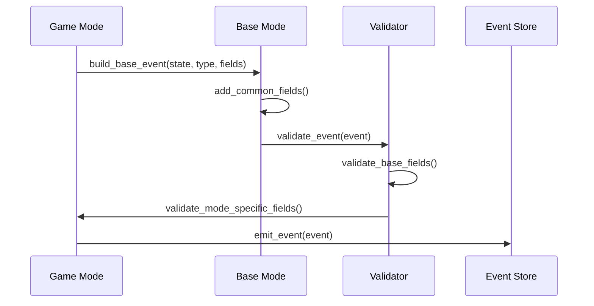
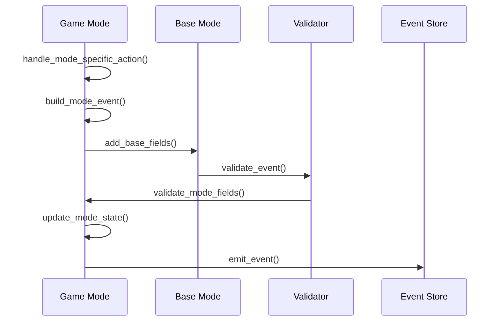

# Game Modes Event Handling

## Overview

This document details how events are handled in the modular game modes architecture, showing how common event handling is shared while allowing mode-specific event customization.

## Core Event Types

### Base Events
```elixir
@type base_event_fields :: %{
  game_id: String.t(),
  mode: atom(),
  round_number: pos_integer(),
  timestamp: DateTime.t(),
  metadata: metadata()
}

@base_events [
  GameStarted,    # Game initialization
  RoundStarted,   # Round transitions
  GuessProcessed, # Guess handling
  GuessAbandoned, # Timeout/quit handling
  RoundCompleted, # Round completion
  GameCompleted   # Game completion
]
```

### Mode-Specific Events

```elixir
# Knockout Mode Events
defmodule KnockoutMode.Events do
  @type team_eliminated :: %{
    required(:game_id) => String.t(),
    required(:team_id) => String.t(),
    required(:round_number) => pos_integer(),
    required(:reason) => :timeout | :max_guesses | :round_loss,
    required(:final_state) => map(),
    required(:timestamp) => DateTime.t()
  }

  @type knockout_round_completed :: %{
    required(:game_id) => String.t(),
    required(:round_number) => pos_integer(),
    required(:eliminated_teams) => [team_info()],
    required(:advancing_teams) => [team_info()],
    required(:timestamp) => DateTime.t()
  }
end

# Race Mode Events
defmodule RaceMode.Events do
  @type time_expired :: %{
    required(:game_id) => String.t(),
    required(:final_matches) => %{team_id() => match_stats()},
    required(:rankings) => [team_id()],
    required(:timestamp) => DateTime.t()
  }
end
```

## Event Handling in Base Mode

### Event Building
```elixir
defmodule GameBot.Domain.GameModes.BaseMode do
  def build_base_event(state, type, fields) do
    Map.merge(
      %{
        game_id: state.game_id,
        mode: state.mode,
        round_number: state.round_number,
        timestamp: DateTime.utc_now(),
        metadata: build_metadata(state)
      },
      fields
    )
    |> struct(type)
  end

  def build_metadata(state, opts \\ []) do
    %{
      client_version: Application.spec(:game_bot, :vsn),
      server_version: System.version(),
      correlation_id: state.correlation_id || generate_correlation_id(),
      causation_id: opts[:causation_id],
      timestamp: DateTime.utc_now()
    }
  end
end
```

### Event Validation
```elixir
defmodule GameBot.Domain.GameModes.BaseMode do
  def validate_event(event, expected_mode, team_requirements \\ :minimum, team_count \\ 1) do
    with :ok <- validate_mode(event, expected_mode),
         :ok <- validate_teams(event.teams, team_requirements, team_count),
         :ok <- validate_metadata(event.metadata) do
      :ok
    end
  end

  defp validate_mode(%{mode: mode}, expected_mode) when mode != expected_mode do
    {:error, "Invalid mode: expected #{inspect(expected_mode)}, got #{inspect(mode)}"}
  end
  defp validate_mode(_, _), do: :ok

  defp validate_metadata(metadata) do
    required = [:client_version, :server_version, :correlation_id, :timestamp]
    case Enum.find(required, &(is_nil(metadata[&1]))) do
      nil -> :ok
      field -> {:error, "Missing required metadata field: #{field}"}
    end
  end
end
```

## Mode-Specific Event Handling

### Two Player Mode
```elixir
defmodule GameBot.Domain.GameModes.TwoPlayerMode do
  def process_guess_pair(state, team_id, guess_pair) do
    with :ok <- validate_guess_pair(state, team_id, guess_pair),
         event <- build_guess_processed_event(state, team_id, guess_pair),
         :ok <- validate_event(event) do
      state = update_state_after_guess(state, team_id, event)
      {:ok, state, [event]}
    end
  end

  defp build_guess_processed_event(state, team_id, guess_pair) do
    build_base_event(state, GuessProcessed, %{
      team_id: team_id,
      player1_word: guess_pair.word1,
      player2_word: guess_pair.word2,
      guess_successful: guess_pair.word1 == guess_pair.word2,
      guess_count: get_in(state.teams, [team_id, :guess_count])
    })
  end
end
```

### Knockout Mode
```elixir
defmodule GameBot.Domain.GameModes.KnockoutMode do
  def handle_round_end(state) do
    with eliminated <- find_eliminated_teams(state),
         event <- build_knockout_round_completed(state, eliminated),
         :ok <- validate_event(event) do
      state = update_state_after_eliminations(state, eliminated)
      {:ok, state, [event]}
    end
  end

  defp build_knockout_round_completed(state, eliminated) do
    build_base_event(state, KnockoutRoundCompleted, %{
      eliminated_teams: eliminated,
      advancing_teams: get_advancing_teams(state, eliminated),
      round_duration: calculate_round_duration(state)
    })
  end
end
```

## Event Flow Patterns

### 1. Standard Event Flow


### 2. Mode-Specific Event Flow


## Best Practices

### 1. Event Building
```elixir
# DO: Use the base event builder
event = build_base_event(state, EventType, fields)

# DON'T: Build events directly
event = %EventType{game_id: id, ...}
```

### 2. Event Validation
```elixir
# DO: Validate before emission
with event <- build_event(state, fields),
     :ok <- validate_event(event) do
  {:ok, state, [event]}
end

# DON'T: Skip validation
event = build_event(state, fields)
{:ok, state, [event]}
```

### 3. State Updates
```elixir
# DO: Update state atomically with event emission
def handle_action(state, params) do
  with event <- build_event(state, params),
       :ok <- validate_event(event),
       state <- update_state(state, event) do
    {:ok, state, [event]}
  end
end

# DON'T: Update state separately
def handle_action(state, params) do
  state = update_state(state, params)
  event = build_event(state, params)
  {:ok, state, [event]}
end
```

### 4. Error Handling
```elixir
# DO: Use descriptive error tuples
{:error, {:invalid_team_count, "Team count must be at least 2"}}

# DON'T: Use generic errors
{:error, "invalid"}
```

## Testing Event Handling

### 1. Event Building Tests
```elixir
defmodule GameBot.Test.GameModes.EventBuildingTest do
  use ExUnit.Case

  test "builds event with required fields" do
    state = build_test_state()
    event = build_base_event(state, TestEvent, %{})
    
    assert event.game_id == state.game_id
    assert event.mode == state.mode
    assert event.round_number == state.round_number
    assert event.metadata != nil
  end
end
```

### 2. Event Validation Tests
```elixir
defmodule GameBot.Test.GameModes.EventValidationTest do
  use ExUnit.Case

  test "validates mode-specific requirements" do
    event = build_test_event(:knockout)
    assert {:error, _} = validate_event(event, :two_player)
    assert :ok = validate_event(event, :knockout)
  end
end
```

### 3. State Update Tests
```elixir
defmodule GameBot.Test.GameModes.StateUpdateTest do
  use ExUnit.Case

  test "updates state atomically with event" do
    state = build_test_state()
    {:ok, new_state, [event]} = process_action(state)
    
    assert new_state.version > state.version
    assert event.state_version == new_state.version
  end
end
```

## Implementation Status

### Completed
1. ✅ Base event structure
2. ✅ Common event validation
3. ✅ Two Player mode events
4. ✅ Knockout mode events

### In Progress
1. 🔶 Race mode events
2. 🔶 Event store integration
3. 🔶 State recovery from events

### Planned
1. ❌ Golf mode events
2. ❌ Longform mode events
3. ❌ Event versioning system 