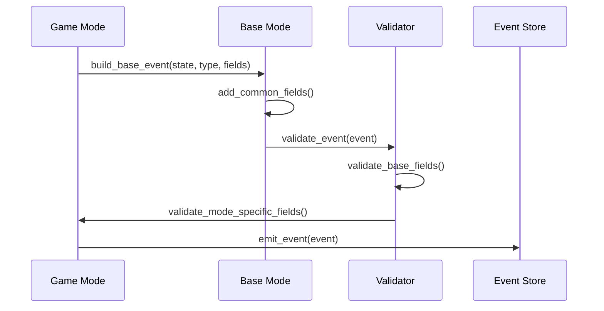
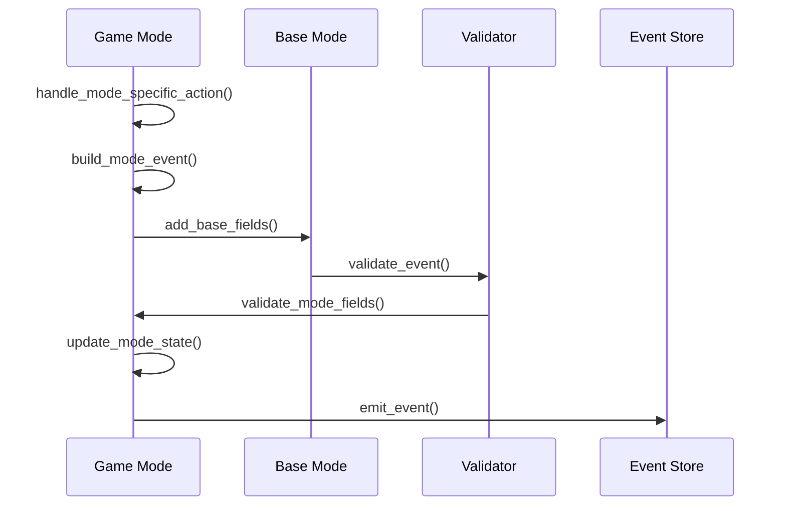

# Game Modes Event Handling

## Overview

This document details how events are handled in the modular game modes architecture, showing how common event handling is shared while allowing mode-specific event customization.

## Event Structure

### Base Events (Common to All Modes)

```elixir
# Shared event types and fields
@type base_event_fields :: %{
  game_id: String.t(),
  mode: atom(),
  round_number: pos_integer(),
  timestamp: DateTime.t(),
  metadata: metadata()
}

# Common events handled by base mode
@base_events [
  GameStarted,
  GuessProcessed,
  GuessAbandoned,
  GameCompleted
]
```

### Mode-Specific Events

```elixir
# Knockout Mode Events
defmodule KnockoutMode.Events do
  @type knockout_round_completed :: %{
    required(:eliminated_teams) => [team_info()],
    required(:advancing_teams) => [team_info()],
    optional(:round_stats) => map()
  }
end

# Race Mode Events
defmodule RaceMode.Events do
  @type time_expired :: %{
    required(:final_matches) => %{team_id() => match_stats()},
    required(:rankings) => [team_id()],
    optional(:time_stats) => map()
  }
end
```

## Event Handling in Base Mode

### Common Event Building

```elixir
defmodule GameBot.Domain.GameModes.BaseMode do
  # Event building helpers available to all modes
  def build_base_event(state, type, fields) do
    Map.merge(
      %{
        game_id: state.game_id,
        mode: state.mode,
        round_number: state.round_number,
        timestamp: DateTime.utc_now(),
        metadata: build_metadata(state)
      },
      fields
    )
    |> struct(type)
  end

  def build_metadata(state, opts \\ []) do
    %{
      client_version: Application.spec(:game_bot, :vsn),
      server_version: System.version(),
      correlation_id: state.correlation_id || generate_correlation_id(),
      causation_id: opts[:causation_id],
      timestamp: DateTime.utc_now()
    }
  end
end
```

### Event Validation

```elixir
defmodule GameBot.Domain.GameModes.EventValidation do
  # Common validation logic
  def validate_event(event) do
    with :ok <- validate_base_fields(event),
         :ok <- validate_mode_specific_fields(event),
         :ok <- validate_metadata(event.metadata) do
      :ok
    end
  end

  defp validate_base_fields(event) do
    # Validate fields common to all events
  end

  defp validate_mode_specific_fields(event) do
    # Delegate to mode-specific validation
    event.__struct__.validate_fields(event)
  end
end
```

## Mode-Specific Event Handling

### Two Player Mode Example

```elixir
defmodule GameBot.Domain.GameModes.TwoPlayerMode do
  use GameBot.Domain.GameModes.BaseMode

  def handle_guess(state, team_id, guess_pair) do
    with :ok <- validate_guess_pair(state, team_id, guess_pair),
         event <- build_guess_processed_event(state, team_id, guess_pair),
         :ok <- validate_event(event) do
      state = update_state_after_guess(state, team_id, event)
      {:ok, state, [event]}
    end
  end

  defp build_guess_processed_event(state, team_id, guess_pair) do
    build_base_event(state, GuessProcessed, %{
      team_id: team_id,
      player1_word: guess_pair.word1,
      player2_word: guess_pair.word2,
      guess_successful: guess_pair.word1 == guess_pair.word2,
      guess_count: get_in(state.teams, [team_id, :guess_count])
    })
  end
end
```

### Knockout Mode Example

```elixir
defmodule GameBot.Domain.GameModes.KnockoutMode do
  use GameBot.Domain.GameModes.BaseMode

  def handle_round_end(state) do
    with eliminated <- find_eliminated_teams(state),
         event <- build_knockout_round_completed(state, eliminated),
         :ok <- validate_event(event) do
      state = update_state_after_eliminations(state, eliminated)
      {:ok, state, [event]}
    end
  end

  defp build_knockout_round_completed(state, eliminated) do
    build_base_event(state, KnockoutRoundCompleted, %{
      eliminated_teams: eliminated,
      advancing_teams: get_advancing_teams(state, eliminated),
      round_duration: calculate_round_duration(state)
    })
  end
end
```

## Event Flow Patterns

### 1. Standard Event Flow



### 2. Mode-Specific Event Flow



## Event Handling Best Practices

1. **Event Building**
   ```elixir
   # DO: Use the base event builder
   event = build_base_event(state, EventType, fields)

   # DON'T: Build events directly
   event = %EventType{game_id: id, ...}
   ```

2. **Validation**
   ```elixir
   # DO: Validate before emission
   with event <- build_event(state, fields),
        :ok <- validate_event(event) do
     {:ok, state, [event]}
   end

   # DON'T: Skip validation
   event = build_event(state, fields)
   {:ok, state, [event]}
   ```

3. **State Updates**
   ```elixir
   # DO: Update state atomically with event emission
   def handle_action(state, params) do
     with event <- build_event(state, params),
          :ok <- validate_event(event),
          state <- update_state(state, event) do
       {:ok, state, [event]}
     end
   end

   # DON'T: Update state separately
   def handle_action(state, params) do
     state = update_state(state, params)
     event = build_event(state, params)
     {:ok, state, [event]}
   end
   ```

## Testing Event Handling

### 1. Base Event Tests

```elixir
defmodule GameBot.Test.GameModes.BaseEventTest do
  use ExUnit.Case

  test "builds event with required fields" do
    state = build_test_state()
    event = build_base_event(state, TestEvent, %{})
    
    assert event.game_id == state.game_id
    assert event.mode == state.mode
    assert event.round_number == state.round_number
    assert event.metadata != nil
  end
end
```

### 2. Mode-Specific Event Tests

```elixir
defmodule GameBot.Test.GameModes.KnockoutModeTest do
  use ExUnit.Case

  test "builds knockout round completed event" do
    state = build_knockout_state()
    eliminated = ["team1"]
    
    {:ok, _state, [event]} = KnockoutMode.handle_round_end(state)
    
    assert event.eliminated_teams == eliminated
    assert length(event.advancing_teams) == 1
  end
end
```

## Migration Guide

1. **Extract Common Event Handling**
   - Move base event building to BaseMode
   - Create shared validation logic
   - Define common event types

2. **Implement Mode-Specific Events**
   - Create mode-specific event modules
   - Add mode-specific validation
   - Implement mode-specific builders

3. **Update Existing Code**
   - Replace direct event creation
   - Add validation calls
   - Update state management

4. **Add Tests**
   - Test base event handling
   - Test mode-specific events
   - Add integration tests 